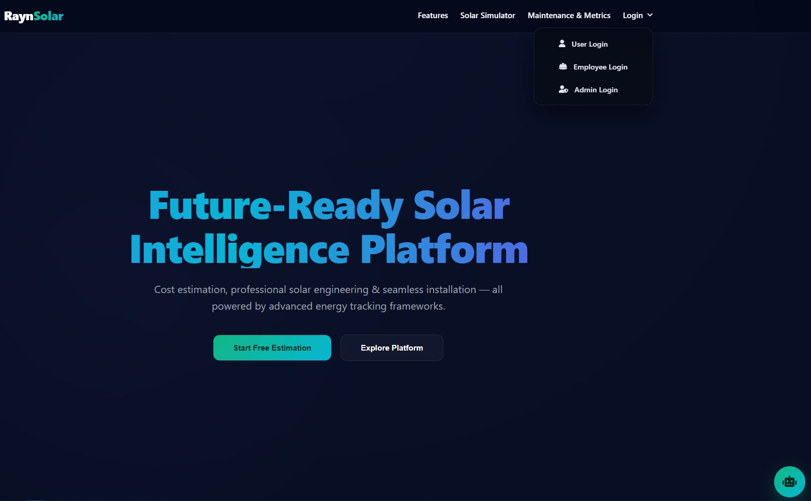
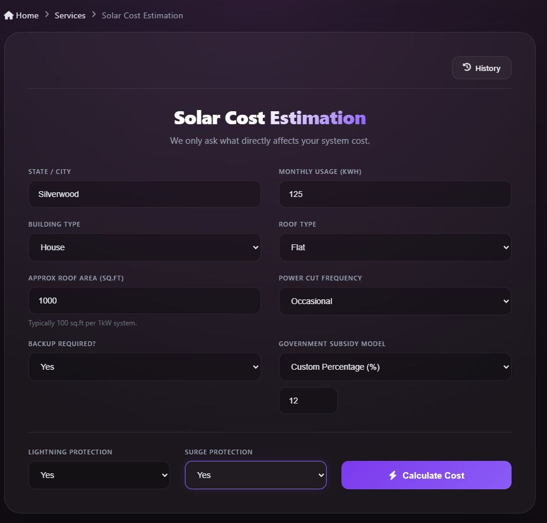
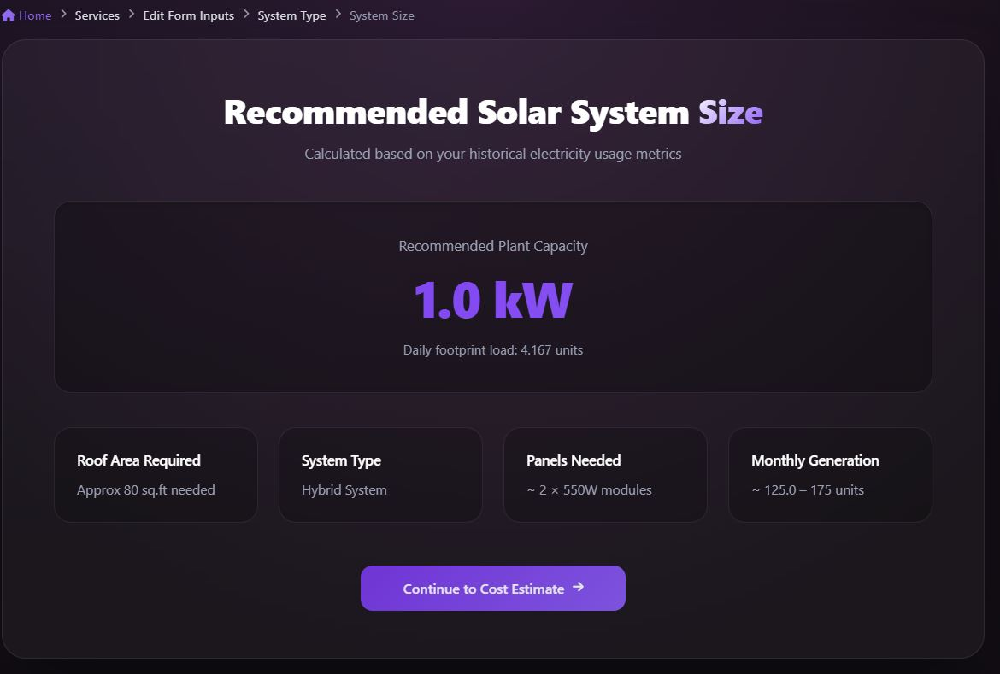
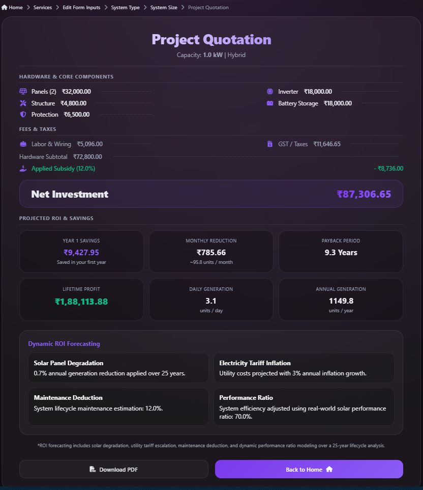
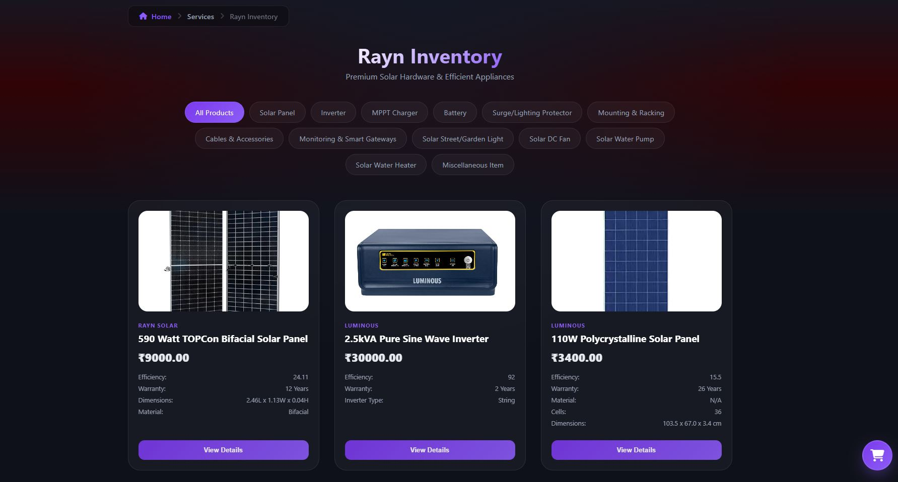
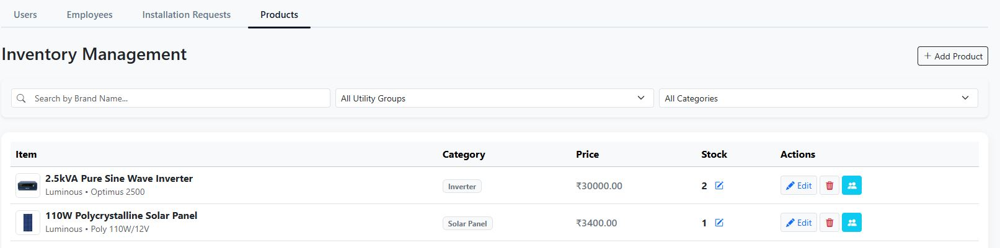
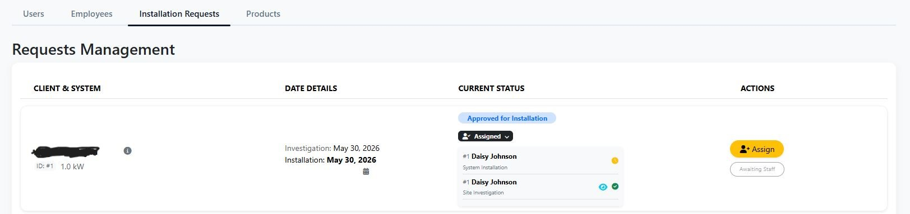
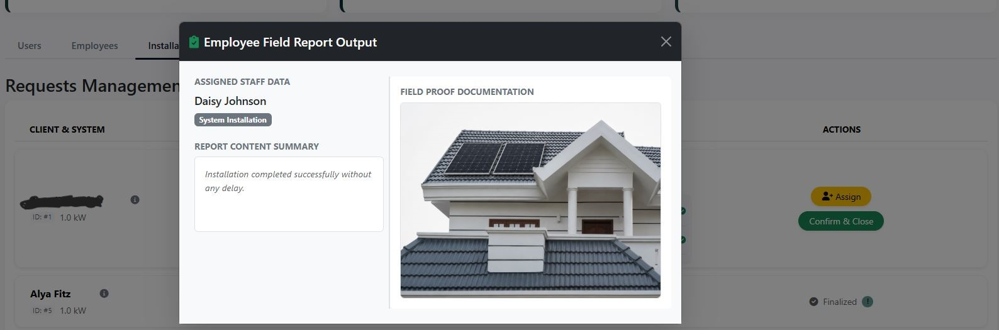
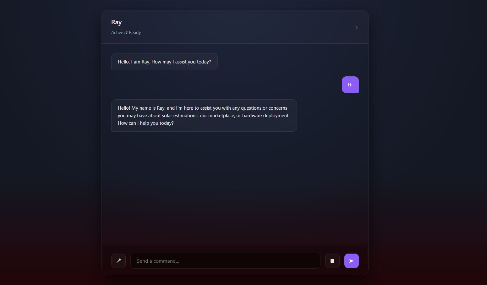

# Rayn Solar – Solar Management System

## Project Overview

Driven by environmental concerns and government incentives, the rapid shift toward renewable energy highlights the need for specialized digital solutions.

**Rayn Solar** is a web-based solar management platform built using HTML, CSS, JavaScript, and Bootstrap for the frontend, Python with the Django framework for the backend, and SQLite3 as the relational database.

The application consists of three independent modules:

1. **Solar Estimation Engine** – Determines the recommended system size, panel requirements, project cost, expected energy generation, and ROI projections.

2. **E-Commerce Storefront** – Allows users to browse and purchase solar hardware and related products.

3. **Installation Lifecycle Management** – Manages the complete installation process through a controlled, role-based workflow.

## Installation Workflow

The installation process follows a structured, role-based workflow:

**Request → Site Inspection → Admin Review → Approval → Installation → Final Report → Invoice → Payment → Completion**

The admin reviews pending requests and schedules site investigations. Assigned field employees conduct inspections and submit work reports. Based on these reports, the admin can reject, approve, or schedule installations.

For approved requests, installation workers carry out the project and submit a final work report upon completion. The admin reviews the report, marks the installation as completed, and records the final payable amount. The system then automatically generates an invoice for the user.

Once payment is completed, the request is finalized.

## AI-Powered Support

The platform also integrates **"Ray," an AI-powered chatbot** that provides technical assistance and user support.

## Key Features

- Solar cost estimation
- Solar panel requirement calculation
- Project cost estimation
- Energy generation and ROI projection
- Solar product purchasing
- User, employee, and admin roles
- Site inspection management
- Installation lifecycle tracking
- Work report submission
- Invoice generation
- Payment tracking
- AI-powered chatbot support

## Technology Stack

- **Frontend:** HTML, CSS, JavaScript, Bootstrap
- **Backend:** Python, Django
- **Database:** SQLite3

## Screenshots

The following screenshots provide an overview of the major features and
workflows implemented in the Rayn Solar system.

### Home Page


### Solar Cost Estimation


### Solar System Recommendation


### Solar System Project Quotation


### Solar Product Marketplace


### Solar Product Management


### Installation Request Management


### Employee Field Report


### Payment


### AI-Powered Support — Ray


The complete step-by-step project documentation is available in the
`screenshots/` directory.

## Project Structure

```text
rayn-solar/
├── Solar/
├── Solar_Management/
├── media/
├── manage.py
├── .gitignore
└── README.md
```

## Project Status

This project was developed as an academic project and is presented here as a source-code showcase.
